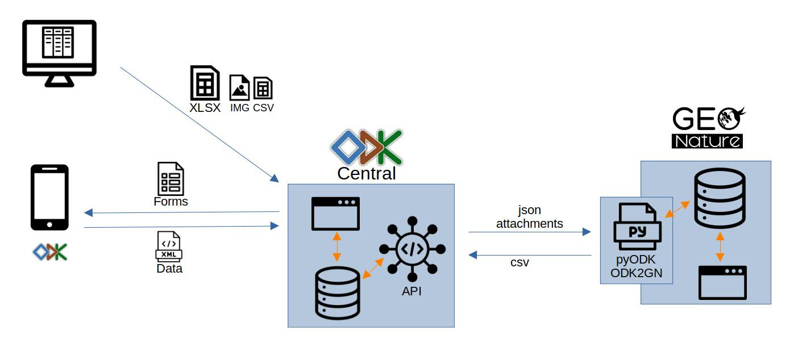

# ODK Central to GeoNature

Module python utilisant les modèles de GeoNature pour intégrer des données depuis l'API d'ODK Central vers la base de données de GeoNature, en utilisant pyodk.

Il permet actuellement d'importer des données collectées avec ODK vers le module Monitoring de GeoNature et de mettre à jour les listes de valeurs du formulaire ODK en fonction des données de la base GeoNature

## Architecture



## Installation

```sh
# Création du virtualenv
python3 -m venv venv && source venv/bin/activate && pip install -U pip

# Installation du module
pip install -e .

# Installation de GeoNature
cd <path_vers_gn>
pip install -e .
cd /backend
pip install -r requirements-dev.in
pip install -r requirements-submodules.in

# Installation du module Monitoring
pip install -e <path_vers_gn_module_monitoring>
```
## Configuration

**ODK central**
Renseigner les paramètres de connexion au serveur central

```
[central]
base_url = "https://odk-test.cevennes-parcnational.net"
username = "username"
password = "password"
default_project_id = 1
```

**Modules monitoring**
Pour chaque module monitoring il faut définir un mapping qui permet d'établir un lien entre la structure du formulaire ODK et les données de GeoNature. Un mapping automatique des champs depuis la configuration du module dans gn_module_monitoring est réalisée si les champs ont le même nom. Si ce n'est pas le cas la correspondance doit être faite dans le fichier de configuration.

La configuration permet de renseigner :
 * le nom du "noeud" de la boucle (repeat) observation
 * le nom des champs qui ne correspondent pas à la configuration spécifiée dans gn_module_monitoring.

exemple protocole STOM
```
[STOM]
    [STOM.SITE]
    [STOM.VISIT]
        comments = "<ecran>/id_base_site"
        id_dataset = "visite/id_jdd"
    [STOM.OBSERVATION]
```

## Commandes

Avant de lancer une commande il faut s'assurer d'être dans le virtualenv de l'application
```sh
source venv/bin/activate
```

### Synchronisation des données de ODK vers GeoNature
Permet de récupérer les données saisies dans ODK central via ODK collect ainsi que les médias associés


```sh
synchronize <MON_CODE_MODULE> --form_id=<ODK_FORM_ID> --project_id=<ODK_PROJECT_ID>
```

### Mise à jour du formulaire ODK
Publie sur ODK central une nouvelle version du formulaire avec une mise à jour des médias à partir des données de GeoNature. Les données envoyées sont :
 * liste des sites
 * liste des taxons
 * liste des observateurs
 * liste des jeux de données
 * liste des nomenclatures


```sh
upgrade_odk_form <MON_CODE_MODULE> --form_id=<ODK_FORM_ID> --project_id=<ODK_PROJECT_ID>
```

Des options permettent de ne pas synchroniser un type de données:
  * `--skip_taxons` : ne pas générer le fichier des taxons
  * `--skip_observers` : ne pas générer le fichier des observateurs
  * `--skip_jdd` : ne pas générer le fichier des jeux de données
  * `--skip_sites` : ne pas générer le fichier des sites
  * `--skip_nomenclatures` : ne pas générer le fichier des nomenclatures
